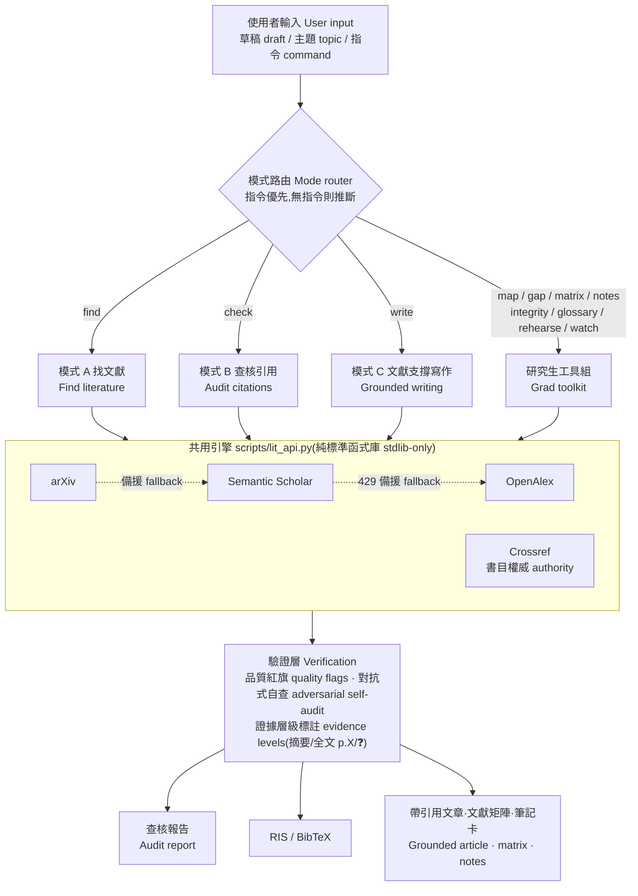

# lit-review — Literature Fetching & Citation Auditing Skill for LLM Agents

**[English](#english) | [中文](#中文)**

---

## English

An agent skill that turns Claude (or Codex, or any capable LLM agent) into a rigorous literature assistant. Give it your draft — it finds supporting literature, and audits every citation you already have: **does the paper exist, is the bibliography correct, and does it actually support the claim you attached it to?**

Built by a grad student finishing a thesis, battle-tested on real thesis chapters. No API keys required to start.

### What it does

**Mode A — Find literature.** Extracts claims from your draft, searches Semantic Scholar / OpenAlex / arXiv, snowballs through citation networks to find classics keyword search misses, judges candidates by their abstracts (not titles), and exports an EndNote/Zotero-ready `.ris` file.

**Mode B — Audit citations.** For every reference in your draft:

1. **Existence** — cross-checks Crossref + Semantic Scholar; catches hallucinated references (and knows that *not found ≠ fabricated*)
2. **Bibliography** — field-by-field diff against Crossref authoritative records (years, venues, author spelling, page numbers); arXiv IDs are cross-checked against their actual titles
3. **Claim support** — reads the abstract and checks whether the paper supports the *specific sentence* citing it; flags overreach ("paper says correlation, you wrote causation"), null-result traps, and subject-population mismatches
4. **Equations & technical details** — when your text attributes a formula to a source, fetches the open-access PDF and compares term by term (caught a missing √ in the attention formula during testing)

### Architecture / 系統架構



Three honesty mechanisms run through every path: bibliographic fields come only from API responses (never from LLM memory), every verdict carries its evidence level, and generated output is audited by a fresh-context skeptic before delivery.

### Design principles

- **Honesty over polish.** "Not found" is reported as not found; "can't judge" is ❓, never a guess. One wrong "verified" is worse than ten honest "unverified".
- **No bibliography from memory.** Every DOI, year, and page number comes from an API response — LLM memory of bibliographic data is unreliable by construction.
- **Quality red flags.** Zero-citation papers in low-tier venues get flagged automatically (with an age gate so new papers aren't punished for being new).
- **Resilient.** Automatic fallbacks: Semantic Scholar → OpenAlex, arXiv → Semantic Scholar. Rate limiting and 429 backoff built in.

### Install

**Claude Code:**

```bash
git clone https://github.com/<you>/lit-review-skill ~/.claude/skills/lit-review
```

Then just ask: *"check the citations in my chapter2.docx"* or *"find literature for this paragraph: …"* — the skill infers the mode from your input.

Or use explicit commands (same words work in Claude Code as `/lit-review <cmd>` and in Codex as plain chat):

| Command | Does |
|---|---|
| `check <draft/file>` | Audit citations (Mode B; auto-adds Mode A if references exist) |
| `find <paragraph/topic>` | Find supporting literature (Mode A) |
| `write <topic>` | Literature-grounded article with citations (Mode C) |
| `verify <one citation>` | Quick single-citation existence + bibliography check |
| `deep` / `quick` | Depth modifier: escalate to OA full text / abstracts only |
| `bibtex` / `no-ris` | Reference file format preference |

**Codex / other agents:** add one line to your `AGENTS.md`:

> For literature search and citation auditing, read `~/.claude/skills/lit-review/SKILL.md` and follow its workflow.

The helper script is pure Python 3.8+ standard library — no pip installs, works anywhere.

### Optional: API keys (recommended for heavy use)

Create a `.env` in your project directory:

```
S2_API_KEY=...        # free from semanticscholar.org/product/api — avoids shared-pool 429s
CROSSREF_MAILTO=you@example.com   # joins the Crossref/OpenAlex polite pools
```

Never commit `.env`. The script reads it automatically (cwd first, then `~/.env`).

### Honest limitations

- Default judgments are abstract-based; "gap" findings mean *the abstract doesn't show it*, not *the paper doesn't contain it*. For verdicts the abstract can't settle, the skill escalates to open-access full text when available (and labels the evidence level) — but paywalled papers stay honestly marked "cannot judge"
- Chinese-language literature: best-effort via Google Scholar when available, otherwise flagged for manual check (the structured APIs barely cover it)
- Books (especially pre-2010): APIs often only index their *reviews* — the skill uses reviews as indirect existence evidence and tells you to check the ISBN
- Google Scholar rate-limits intermittently; a zero-result there is treated as "check failed", never "doesn't exist"

---

## 中文

把 Claude(或 Codex、任何夠力的 LLM agent)變成嚴謹文獻助手的 skill。丟一段草稿給它——幫你找支持文獻,並逐筆查核既有引用:**文獻存在嗎?書目對嗎?它真的支持你掛它的那句話嗎?**

由一個趕論文的碩士生打造,在真實論文章節上實戰測試過。不需要金鑰即可使用。

### 功能

**模式 A(找文獻)**:從草稿萃取論點 → 搜尋 Semantic Scholar / OpenAlex / arXiv → 引文滾雪球(挖出關鍵字搜不到的經典)→ 依摘要而非標題判讀 → 產出可匯入 EndNote/Zotero 的 `.ris`。

**模式 B(查核引用)**:每筆引用四層檢驗——

1. **存在性**:Crossref + Semantic Scholar 雙源交叉;抓幻覺引用(並且懂「查不到 ≠ 不存在」)
2. **書目正確性**:與 Crossref 權威資料逐欄比對(年份/期刊/作者拼字/頁碼);arXiv 編號與標題交叉覆核
3. **內容支持度**:讀摘要,對照文中引用該文獻的**那句話**;抓「文獻講相關、你寫因果」的過度延伸、零結果陷阱、母體錯位
4. **方程式/技術細節**:文中把公式歸給某文獻時,抓開放取用 PDF 逐項比對(測試時抓到過 attention 公式漏根號)

### 設計原則

- **誠實優先**:查不到就說查不到,判不了就標 ❓。一筆錯誤的「已驗證」比十筆誠實的「無法判斷」危害更大。
- **書目不靠記憶**:所有 DOI、年份、頁碼一律來自 API 回傳——LLM 記憶中的書目資料天生不可靠。
- **品質紅旗**:低層級期刊的零被引文獻自動標警(有年齡門檻,不冤枉新文獻)。
- **抗故障**:S2→OpenAlex、arXiv→S2 自動備援,內建速率限制與退避重試。

### 安裝

**Claude Code**:clone 到 `~/.claude/skills/lit-review`,然後直接說「幫我查這章的引用」就會觸發(自動推斷模式);也可下明確指令:`check <檔案>` 查核、`find <段落>` 找文獻、`write <主題>` 文獻支撐寫作、`verify <單筆引用>` 快查,修飾詞 `deep`/`quick` 控制深度、`bibtex`/`no-ris` 控制輸出。Codex 打一樣的指令詞即可。

**Codex / 其他 agent**:在 `AGENTS.md` 加一行「文獻搜尋與引用查核請讀 `~/.claude/skills/lit-review/SKILL.md` 並照其流程執行」。

腳本為純 Python 標準函式庫(3.8+),不需安裝任何套件。

### 選配金鑰

專案目錄放 `.env`(**不要進 git**):`S2_API_KEY`(semanticscholar.org 免費申請,避開共享池壅塞)、`CROSSREF_MAILTO`(進禮貌池)。

### 誠實的限制

- 預設判讀基於摘要;「缺口」代表摘要看不出來,不代表內文沒有。摘要判不動的關鍵引用會升級到開放取用全文(並標明證據層級);付費牆內的誠實標「無法判斷」
- 中文文獻:有 Google Scholar 工具時盡力查(標信心中等),否則列人工查核——結構化 API 幾乎不收
- 專書(尤其 2010 年前):API 常只收錄書評——skill 會把書評當存在性間接證據,並提醒你核 ISBN
- `references/api-notes.md` 是實戰踩坑全紀錄,除錯前先讀它

### 範例

`examples/planted_errors_test.md` 是一份埋了五種錯誤的測試稿(錯年份、錯場刊、捏造文獻、中文文獻、缺引用論點)——拿它試跑,看 skill 能不能全抓到。

---

MIT License. Issues and PRs welcome.
