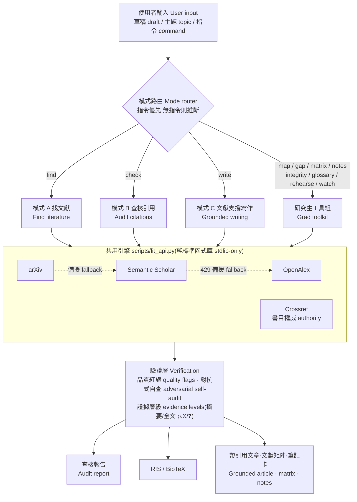

# lit-review — Literature Fetching & Citation Auditing Skill for LLM Agents

**English** | [繁體中文](README.zh-TW.md)

An agent skill that turns Claude (or Codex, or any capable LLM agent) into a rigorous literature assistant. Give it your draft — it finds supporting literature, and audits every citation you already have: **does the paper exist, is the bibliography correct, and does it actually support the claim you attached it to?**

Built by a grad student finishing a thesis, battle-tested on real thesis chapters. No API keys required to start.

## Architecture

<picture>
  <source media="(prefers-color-scheme: dark)" srcset="assets/architecture-dark.svg">
  
</picture>

*(Diagram generated by `assets/gen_diagram.py` — edit text or colors and re-run; the palette is CVD-validated. A Mermaid source lives below for quick in-browser edits.)*

<details>
<summary>Mermaid version (editable in-browser)</summary>



</details>

Three honesty mechanisms run through every path: bibliographic fields come only from API responses (never from LLM memory), every verdict carries its evidence level, and generated output is audited by a fresh-context skeptic before delivery.

## What it does

**Mode A — Find literature.** Extracts claims from your draft, searches Semantic Scholar / OpenAlex / arXiv, snowballs through citation networks to find classics keyword search misses, judges candidates by their abstracts (not titles), and exports an EndNote/Zotero-ready `.ris` file.

**Mode B — Audit citations.** For every reference in your draft:

1. **Existence** — cross-checks Crossref + Semantic Scholar; catches hallucinated references (and knows that *not found ≠ fabricated*)
2. **Retraction** — every DOI is checked against Crossref update notices (incl. Retraction Watch data), by default, at zero LLM cost
3. **Bibliography** — field-by-field diff against Crossref authoritative records (years, venues, author spelling, page numbers); arXiv IDs are cross-checked against their actual titles
4. **Claim support** — reads the abstract and checks whether the paper supports the *specific sentence* citing it; flags overreach ("paper says correlation, you wrote causation"), null-result traps, and population mismatches
5. **Equations & technical details** — when your text attributes a formula to a source, fetches the open-access PDF and compares term by term

**Mode C — Grounded writing.** Give it a topic; it retrieves first, writes second, and self-audits last — every cited claim traceable to retrieved evidence, expository passages explicitly uncited.

**Grad toolkit.** Thirteen thesis-lifecycle tools: literature matrix, field map, research-gap detection, note cards, citation-integrity check, terminology consistency, committee-question rehearsal, new-literature watch, citation-needed annotation, counter-evidence search, evidence-strength grading, claim–evidence ledger, retraction lookup.

## Quick start

**Claude Code:**

```bash
git clone https://github.com/<you>/lit-review-skill ~/.claude/skills/lit-review
```

Then just ask: *"check the citations in my chapter2.docx"* or *"find literature for this paragraph: …"* — the skill infers the mode from your input.

Or use explicit commands (same words work in Claude Code as `/lit-review <cmd>` and in Codex as plain chat):

| Command | Does |
|---|---|
| `check <draft/file>` | Audit citations (Mode B; auto-adds Mode A if references exist) |
| `find <paragraph/topic>` | Find supporting literature (Mode A) |
| `write <topic>` | Literature-grounded article with citations (Mode C) |
| `verify <one citation>` | Quick single-citation existence + bibliography check |
| `annotate <file>` | Mark which sentences need citations |
| `counter <claim>` | Deliberately search for null/contrary evidence |
| `strength <paper+claim>` | Evidence-quality grading (meta-analysis vs. small cross-sectional, at a glance) |
| `claims <file>` | Claim–evidence ledger: support/oppose counts and strength per claim |
| `matrix` `map` `gap` `notes` `integrity` `glossary` `rehearse` `watch` `retract` `versions` `export-xml` | Grad toolkit — see [USAGE.md](USAGE.md) |
| `deep` / `quick` / `thorough` | Depth & verification-intensity modifiers |
| `bibtex` / `no-ris` | Reference-file format preference |

**Codex / other agents:** add one line to your `AGENTS.md`:

> For literature search and citation auditing, read `<clone-path>/SKILL.md` and follow its workflow.

The helper script is pure Python 3.8+ standard library — no pip installs, works anywhere.

**Full walkthrough: [USAGE.md](USAGE.md)**

## Optional: API keys (recommended for heavy use)

Create a `.env` in your project directory:

```
S2_API_KEY=...        # free from semanticscholar.org/product/api — avoids shared-pool 429s
CROSSREF_MAILTO=you@example.com   # joins the Crossref/OpenAlex polite pools
```

Never commit `.env`. The script reads it automatically (cwd first, then `~/.env`).

## Design principles

- **Honesty over polish.** "Not found" is reported as not found; "can't judge" is ❓, never a guess. One wrong "verified" is worse than ten honest "unverified".
- **No bibliography from memory.** Every DOI, year, and page number comes from an API response — LLM memory of bibliographic data is unreliable by construction.
- **Isolation firewalls.** Evidence isolation (model memory may raise suspicion, only supplied evidence may convict), role isolation (the writer never audits itself), injection isolation (retrieved abstracts/PDFs are untrusted data — embedded instructions are reported, never followed).
- **Quality red flags.** Zero-citation papers in low-tier venues get flagged automatically (with an age gate so new papers aren't punished for being new).
- **Cost tiers.** `quick` (single agent, labeled "no independent audit") / default (one fresh-context skeptic, ~1.5–2×) / `thorough` (per-claim adversarial verification, 5–10×) — verification intensity follows the cost of being wrong.
- **Resilient.** Automatic fallbacks: Semantic Scholar → OpenAlex, arXiv → Semantic Scholar. Rate limiting and 429 backoff built in.

## Honest limitations

- Default judgments are abstract-based; "gap" findings mean *the abstract doesn't show it*, not *the paper doesn't contain it*. For verdicts the abstract can't settle, the skill escalates to open-access full text when available (and labels the evidence level) — but paywalled papers stay honestly marked "cannot judge"
- Chinese-language literature: best-effort via Google Scholar when available, otherwise flagged for manual check (the structured APIs barely cover it)
- Books (especially pre-2010): APIs often only index their *reviews* — the skill uses reviews as indirect existence evidence and tells you to check the ISBN
- Industry proceedings (IPC/SMTA-style) are a blind spot for *every* database, including commercial ones — the skill says "not found in any index, verify with the publisher", never "fabricated"
- The tool makes bad citations harder to produce, but **the selection and interpretation of literature remains the author's responsibility** — it's a guardrail, not a chauffeur

## Example

`examples/planted_errors_test.md` is a test draft with five planted problems (wrong year, wrong venue, a fabricated reference, a Chinese-language reference, an uncited claim) — run the skill on it and see whether everything gets caught.

---

MIT License. Issues and PRs welcome.
