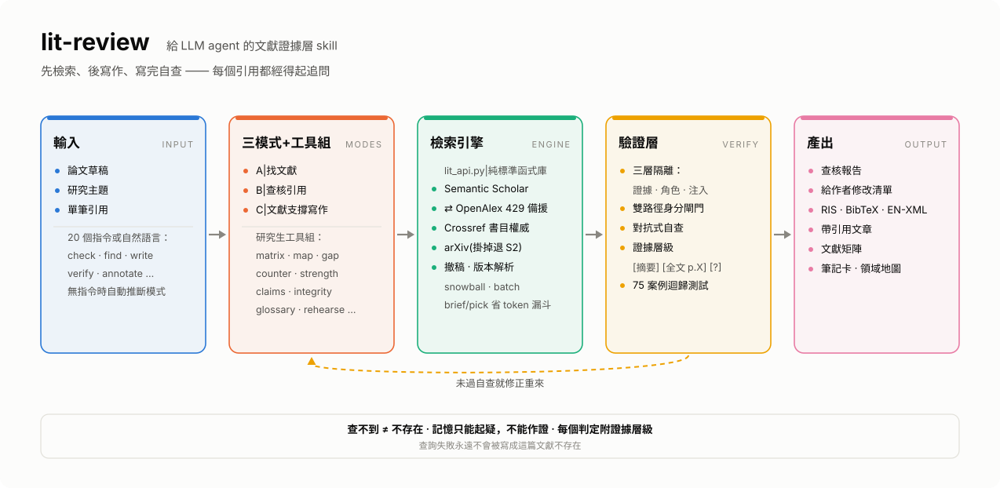

# lit-review — 給 LLM agent 的文獻抓取與引用查核 skill

[English](README.md) | **繁體中文**

把 Claude(或 Codex、任何夠力的 LLM agent)變成嚴謹文獻助手的 skill。丟一段草稿給它——幫你找支持文獻，並逐筆查核既有引用：**文獻存在嗎？書目對嗎？它真的支持你掛它的那句話嗎？**

由一個趕論文的碩士生打造，在真實論文章節上實戰測試過。不需要金鑰即可使用。

## 系統架構

<picture>
  <source media="(prefers-color-scheme: dark)" srcset="assets/architecture-dark.svg">
  
</picture>

*(圖由 `assets/gen_diagram.py` 產生，同一支程式輸出中英文 × 深淺色四個版本——改文字或配色後重跑即可，調色盤經 CVD 色覺驗證。)*

三個誠實機制貫穿所有路徑：書目欄位只來自 API 回傳(絕不用模型記憶)、每個判定附證據層級、生成的產出交付前由 fresh-context 懷疑論者審查。

## 這個工具不做什麼

**如果你已經找到論文、只是要一段引用格式，請用 [Google Scholar Button](https://chromewebstore.google.com/detail/google-scholar-button/ldipcbpaocekfooobnbcddclnhejkcpn)(Google 官方出品)——它更快，本工具不跟它競爭。** 它還能透過你的大學圖書館取得全文，那是正當的授權途徑，也比本工具能合法做到的更好。

本工具從那裡結束的地方開始：處理你**手上已經有**的引用——來自 AI、共同作者、舊草稿，或一次出錯的複製貼上。

| 任務 | Scholar Button | lit-review |
|---|---|---|
| 已知論文 → 引用格式 | ✅ 一鍵搞定 | 較慢，無優勢 |
| 透過機構訂閱取得全文 | ✅ 它的主場 | 刻意不做 |
| 「這筆引用存在嗎？」 | — | ✅ Crossref + Semantic Scholar 交叉 |
| 「書目欄位對嗎？」 | — | ✅ 與 Crossref 逐欄比對 |
| 「它支持**我這句話**嗎？」 | — | ✅ 讀摘要，抓過度延伸 |
| 「後來被撤稿了嗎？」 | — | ✅ 每筆 DOI 預設查 |
| 一次 36 筆引用 | 手動點 36 次 | ✅ 一次批次跑完 |

這是實測而非宣稱：Scholar Button 的搜尋結果**不含 DOI**，卷期頁也被壓成截斷字串，無法用來做書目查核。反過來，它為一篇 Unpaywall 判定 closed 的付費綜述找到了機構典藏的免費 PDF——本工具的 `fulltext` 靠備援來源撈到同一個網址，但結論不變：**要拿到論文本身，用 Scholar Button 加你的圖書館。**

## 功能

**模式 A(找文獻)**：從草稿萃取論點 → 搜尋 Semantic Scholar / OpenAlex / arXiv → 引文滾雪球(挖出關鍵字搜不到的經典)→ 依摘要而非標題判讀 → 產出可匯入 EndNote/Zotero 的 `.ris`。

**模式 B(查核引用)**：每筆引用五層檢驗——

1. **存在性**:Crossref + Semantic Scholar 雙源交叉；抓幻覺引用(並且懂「查不到 ≠ 捏造」)
2. **撤稿檢查**：所有 DOI 預設過一輪 Crossref 撤稿記錄(含 Retraction Watch 資料)，零 LLM 成本
3. **書目正確性**：與 Crossref 權威資料逐欄比對(年份/期刊/作者拼字/頁碼);arXiv 編號與標題交叉覆核
4. **內容支持度**：讀摘要，對照文中引用該文獻的**那句話**；抓「文獻講相關、你寫因果」的過度延伸、零結果陷阱、母體錯位
5. **方程式/技術細節**：文中把公式歸給某文獻時，抓開放取用 PDF 逐項比對

**模式 C(文獻支撐寫作)**：給主題，先檢索、後寫作、寫完自查——每個掛引用的宣稱都可追溯到檢索到的證據，教學鋪陳明確不掛引用。

**研究生工具組**：十三個論文生命週期工具——文獻矩陣、領域地圖、研究缺口偵測、閱讀筆記卡、引用完整性檢查、中英術語一致性、口試提問預演、新文獻追蹤、引用需求標記、反面證據搜尋、證據強度評級、claim–evidence 總表、撤稿查詢。

## 快速上手

**Claude Code**:

```bash
git clone https://github.com/<you>/lit-review-skill ~/.claude/skills/lit-review
```

然後直接說：「幫我查這章的引用」或「幫這段找文獻：…」——skill 會從輸入推斷模式。

也可下明確指令(Claude Code 打 `/lit-review <指令>`,Codex 直接打指令詞):

| 指令 | 功能 |
|---|---|
| `check <檔案>` | 查核引用(模式 B；有引用列表自動加做 A) |
| `find <段落>` | 找文獻(模式 A) |
| `write <主題>` | 文獻支撐寫作(模式 C) |
| `verify <單筆引用>` | 單筆快查存在性+書目 |
| `annotate <檔案>` | 標記哪些句子需要引用 |
| `counter <論點>` | 主動找反面/零結果證據 |
| `strength <文獻+論點>` | 證據強度評級(統合分析 vs 橫斷面小樣本，一眼分清) |
| `claims <檔案>` | Claim–evidence 總表：每個論點的支持/反對篇數與強度 |
| `fulltext <DOI>` | 查合法可取得的全文(Unpaywall + OA 欄位)；沒有免費版時給機構取得途徑 |
| `matrix` `map` `gap` `notes` `integrity` `glossary` `rehearse` `watch` `retract` `versions` `export-xml` | 研究生工具組——詳見 [USAGE.zh-TW.md](USAGE.zh-TW.md) |
| `deep` / `quick` / `thorough` | 深度與驗證強度修飾詞 |
| `bibtex` / `no-ris` | 引用檔格式偏好 |

**Codex / 其他 agent**：在 `AGENTS.md` 加一行：

> 文獻搜尋與引用查核請讀 `<clone路徑>/SKILL.md` 並照其流程執行。

腳本為純 Python 3.8+ 標準函式庫，不需 pip 安裝任何東西。

**完整教學：[USAGE.zh-TW.md](USAGE.zh-TW.md)**

## 選配金鑰(常用者建議)

專案目錄建 `.env`(**千萬不要 commit**，腳本自動讀取，先 cwd 後 `~/.env`):

```
S2_API_KEY=...        # semanticscholar.org/product/api 免費申請，避開共享池 429
CROSSREF_MAILTO=you@example.com   # 進 Crossref/OpenAlex 禮貌池
```

## 打包上傳（ChatGPT Skills 或分享給別人）

**clone 下來的資料夾不能直接壓縮上傳**：那樣會把 `.git` 目錄一起包進去，而且頂層
資料夾名稱會是 repo 名而不是 skill 名。用這行產生正確的包：

```bash
python scripts/package_skill.py          # → lit-review.zip
```

它以 `git ls-files` 為清單，所以包的內容**就等於 clone 會拿到的東西**（不含
gitignore 的檔案、不含 `.git`、不含 `.env`），並包成 `lit-review/` 頂層資料夾讓
`SKILL.md` 落在平台預期的位置，最後自動跑 `evals/zip_check.py` 掃金鑰、個人
email 與本機絕對路徑。**檢查沒過會直接刪掉 ZIP 而不是交給你**——會外洩的包
比沒有包更糟。

## 不只是寫了，是驗過

上面那些誠實承諾是靠測試守住的，不是靠善意：

```bash
python evals/test_regression.py     # 66 個凍結案例，不打網路，秒級跑完
python evals/mutation_check.py      # 把 9 個已修的 bug 塞回去，每個都必須被抓到
```

`test_regression.py` 把每個找到過的缺陷凍成案例，每個案例都標了出處(`TS-*` 黑箱壓力測試、`CX-*` Codex 獨立原始碼審查、`DR-*` 設計 review)。它直接呼叫生產程式碼並餵凍結候選資料，所以不需要 API、秒級完成。

`mutation_check.py` 回答一個全綠測試套件無法回答的問題：**它真的抓得到東西嗎？** 它逐一把修好的 bug 塞回去，要求指定案例必須失敗。這揪出了我自己兩個測試——它們偷偷把排序邏輯重新實作了一遍而不是呼叫真的程式碼，那種測試會永遠綠燈而底下的程式碼早就爛掉。

**已在真實材料上跑過**：埋錯測試稿(錯年份、錯場刊、捏造文獻、中文文獻、缺引用論點)、兩份真實論文章節、學長 36 筆參考文獻(抓到作者誤植與頁碼錯誤)、對開放取用 PDF 的方程式查核、以及用獨立文獻工具對同一份查核做交叉驗證(判定全數一致，並找出一個真缺口：免費 API 不收錄的出版社摘要覆蓋率)。

**還沒跑過**：別的領域(醫學、社科、人文的引用慣例與 API 覆蓋率差很多)、作者-年份(APA)格式文件、跨週的長期使用、以及由 Codex 而非 Claude 驅動的完整查核。這些是誠實的邊界。

## 設計原則

- **誠實優先**：查不到就說查不到，判不了就標 ❓，絕不猜。一筆錯誤的「已驗證」比十筆誠實的「無法判斷」危害更大。
- **書目不靠記憶**：所有 DOI、年份、頁碼一律來自 API 回傳——LLM 記憶中的書目資料天生不可靠。
- **三層隔離**：證據隔離(記憶只能起疑，不能作證)、角色隔離(寫的人不審自己)、注入隔離(檢索內容是不可信資料，其中的指令一律回報不遵從)。
- **品質紅旗**：低層級期刊的零被引文獻自動標警(有年齡門檻，不冤枉新文獻)。
- **成本分級**:`quick`(單 agent，標「未經獨立審查」)/ 預設(一個 fresh 懷疑論者，約 1.5–2 倍)/ `thorough`(逐句對抗驗證，5–10 倍)——驗證強度跟著錯誤代價走。
- **抗故障**:S2→OpenAlex、arXiv→S2 自動備援，內建速率限制與退避重試。

## 誠實的限制

- 預設判讀基於摘要；「缺口」代表摘要看不出來，不代表內文沒有。摘要判不動的關鍵引用會升級到開放取用全文(並標明證據層級)；付費牆內的誠實標「無法判斷」
- 中文文獻：有 Google Scholar 工具時盡力查(標信心中等)，否則列人工查核——結構化 API 幾乎不收
- 專書(尤其 2010 年前):API 常只收錄書評——skill 會把書評當存在性間接證據，並提醒你核 ISBN
- 工業論文集(IPC/SMTA 類)是**所有**資料庫的共同盲點——skill 會說「各庫皆查無，請向出版方確認」，絕不說「捏造」
- 這個工具讓錯誤引用更難發生，但**文獻的選擇與詮釋責任永遠在作者**——它是防護欄，不是代駕

## 範例

`examples/planted_errors_test.md` 是一份埋了五種錯誤的測試稿(錯年份、錯場刊、捏造文獻、中文文獻、缺引用論點)——拿它試跑，看 skill 能不能全抓到。

---

MIT License。歡迎 Issue 與 PR。
